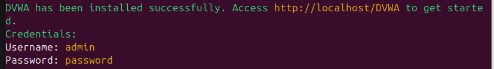
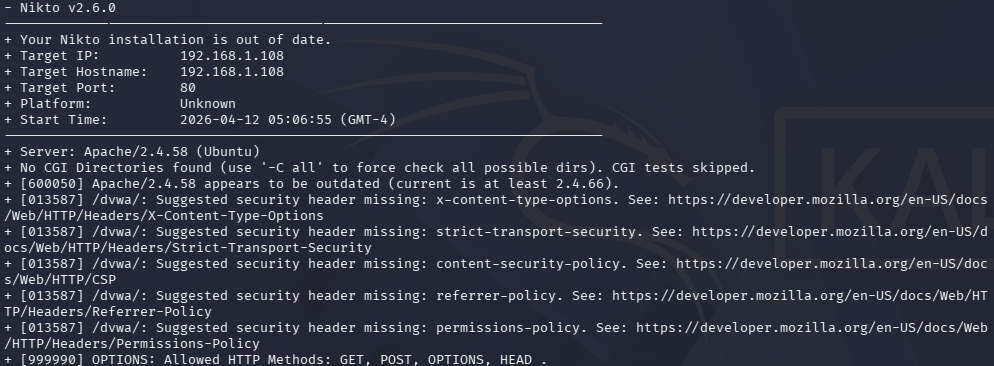
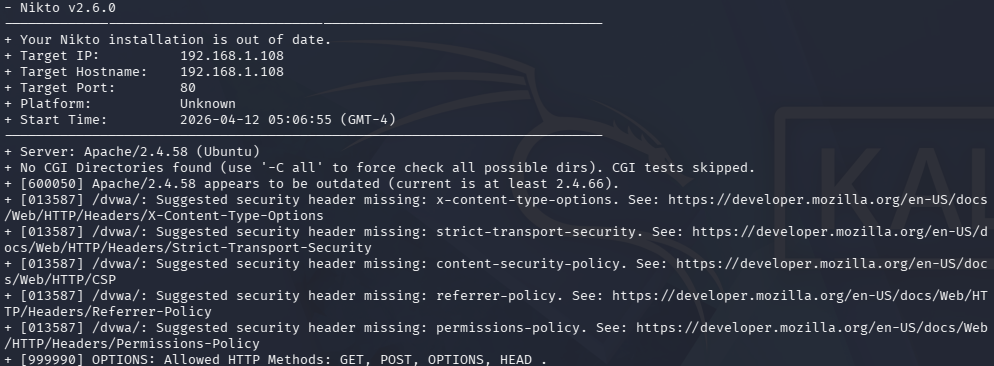

# DVWA
Damn Vulnerable Web Application is a web application designed for security professionals to test there skills in a legal environment. The goal of this lab is to create website monitoring of DVWA using Wazuh to learn how website attack can be detected.

## Installing and Setting up DVWA
First step will be to install DVWA and configure it so attacking it is possible. Run the one liner installation command:
```bash
sudo bash -c "$(curl --fail --show-error --silent --location https://raw.githubusercontent.com/IamCarron/DVWA-Script/main/Install-DVWA.sh)"
```
After installation is completed login credentials will be provided as seen below


To get DVWA up and running we need to open DVWA by browsing `http://localhost/DVWA`:
1. Login with credential
2. Go to setup DVWA
3. Click on create/reset database
4. Login again 
5. Go to DVWA Securty section
6. Set Security level to low

Now our DVWA is ready to be attacked

## Teler Setup
To monitor DVWA we will need an IDS. Teler is a real-time HTTP intrusion detection and threat alert tool that analyses web server logs to identify suspicious activity. I will be using this to allow attacks on DVWA to be logged on Wazuh.

Download Teler:
```bash
wget https://github.com/kitabisa/teler/releases/download/v2.0.0-rc.3/teler_2.0.0-rc.3_linux_amd64.tar.gz
tar -xvzf teler_2.0.0-rc.3_linux_amd64.tar.gz
```

Download `teler.yaml` rule temeplate (make sure this is on the same directory as teler binary):
```bash
wget https://raw.githubusercontent.com/kitabisa/teler/v2/teler.example.yaml
```

After downloading all the files we modify `teler.yaml` log format and logs section:
```yaml
log_format: |
  $remote_addr - $remote_user [$time_local] "$request_method $request_uri $request_protocol" $status $body_bytes_sent "$http_referer" "$http_user_agent"
```

```yaml
logs:
  file:
    active: true 
    json: true 
    path: "/var/log/teler/output.log" # location is whatever you want it to be
```

Now we modify Wazuh congi file `ossec_config` to ensure Wazuh is collecting logs from teler.
```
<localfile>
  <log_format>syslog</log_format>
  <location>/var/log/teler/output.log</location>
</localfile>
```

Add new custom rules on Wazuh to report on specific events e.g. directory traversal
```xml
<group name="teler,">
 <rule id="100012" level="10">
   <decoded_as>json</decoded_as>
   <field name="category" type="pcre2">Common Web Attack(: .*)?|CVE-[0-9]{4}-[0-9]{4,7}</field>
   <field name="request_uri" type="pcre2">\D.+|-</field>
   <field name="remote_addr" type="pcre2">\d+.\d+.\d+.\d+|::1</field>
   <mitre>
     <id>T1210</id>
   </mitre>
   <description>teler detected $(category) against resource $(request_uri) from $(remote_addr)</description>
 </rule>
   
 <rule id="100013" level="10">
   <decoded_as>json</decoded_as>
   <field name="category" type="pcre2">Bad (IP Address|Referrer|Crawler)</field>
   <field name="request_uri" type="pcre2">\D.+|-</field>
   <field name="remote_addr" type="pcre2">\d+.\d+.\d+.\d+|::1</field>
   <mitre>
     <id>T1590</id>
   </mitre>
   <description>teler detected $(category) against resource $(request_uri) from $(remote_addr)</description>
 </rule>

 <rule id="100014" level="10">
   <decoded_as>json</decoded_as>
   <field name="category" type="pcre2">Directory Bruteforce</field>
   <field name="request_uri" type="pcre2">\D.+|-</field>
   <field name="remote_addr" type="pcre2">\d+.\d+.\d+.\d+|::1</field>
   <mitre>
     <id>T1595</id>
   </mitre>
   <description>teler detected $(category) against resource $(request_uri) from $(remote_addr)</description>
 </rule>
</group>
```

Start Teler
```bash
tail -f /var/log/apache2/access.log | ./teler -c teler.yaml
```

# Attack Emulation
## Attack
Open up kali vm or another attacking machine. Run:
```
nikto -h http://192.168.1.108/dvwa/login.php
```

`-h` specifies url

**`http://192.168.1.108/dvwa` may or may not work based off how DVWA handles default web pages on attacking machine**



## Detection
You should be able to see events on threathunting > events and teler if the attack was sucessful/attempted.
