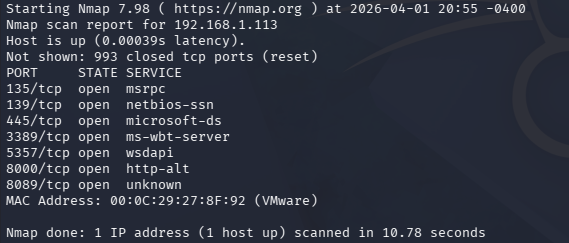
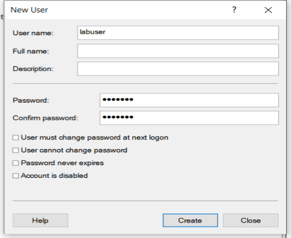
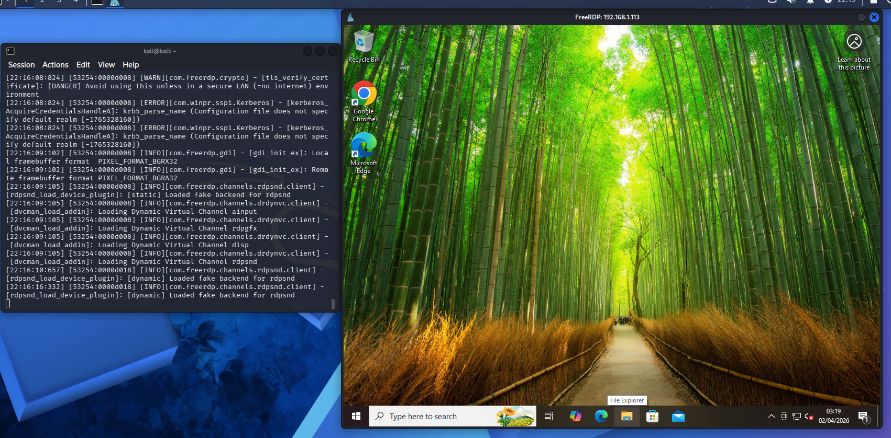
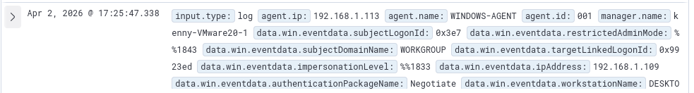
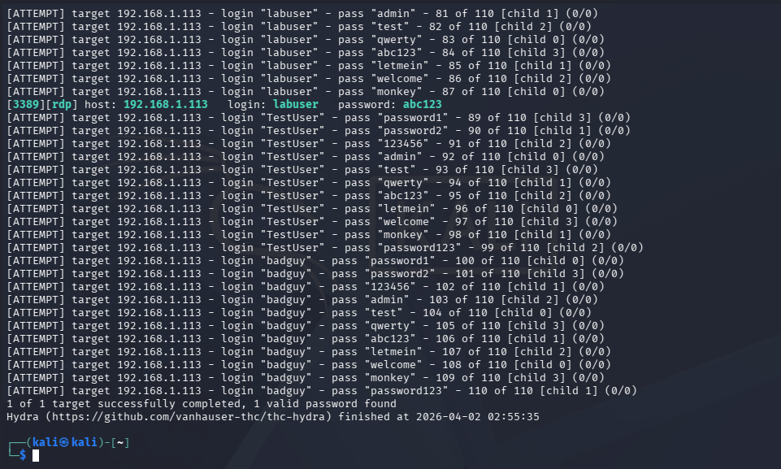
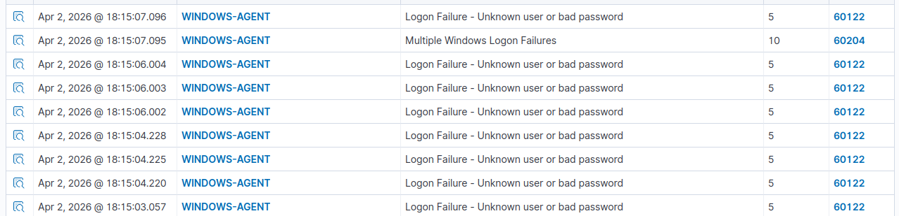

# RDP Bruteforce Attack
This section aims to replicate the basics of detecting RDP bruteforce. Remote Desktop Protocol(RDP) allows users from another computer to control target machine. Attackers can use RDP to access a particular device/machine on the network and one method is by bruteforcing the credentials of RDP connection. This documentation will explain how to setup the lab for RDP and setup a detection method against it.

Tools used:
- RDP
- Kali Linux - Attacker
- Hydra - Bruteforce tool
- Wazuh - Monitoring

# Setup
## Windows (Victim)
**First step is to disable firewall which can be done by:**
```Powershell
advfirewall set allprofiles state off
```
Now we can ping Windows Machine from Kali Linux or any other machines in the same network

**Next part is to enable rdp:**
1. Press `WIN + R` on windows machine
2. Enter `sysdm.cpl`
3. Go to `Remote` tab
4. Select `Allow remote connections to this computer`



Upon running nmap scan from Kali Linux we can see default RDP port `3389`

**Finally, we want to add new user for testing:**
1. Press `WIN + R`
2. Enter lusrmgr.msc
3. Go to Users and right click users and click new user 
4. Fill:
	Username: `labuser`
	Password: `abc123`
5. Click Create



**To add `labuser` to administrator and enable RDP for it on command prompt as adminstrator run:**
```Powershell
net localgroup Administrators labuser /add
net localgroup "Remote Desktop Users" labuser /add
```

**To test RDP connection from Kali**
```Powershell
xfreerdp /u:labuser /p:abc123 /v:192.168.1.113 /cert:ignore
```
Result image:


You can also see it from Wazuh:


**Before we move we need to make sure windows machine is sending login logs to Wazuh manager(Ubuntu):**
Open `Local Security Policy` → `Security Settings` → `Local Policies` → `Audit Policy` → `Audit Logon Events` → `Success` and `Failure` checked.

Now our Windows machine is ready for attack.

## Wazuh (Monitoring)
On Wazuh machine terminal run:
```bash
sudo nano /var/ossec/etc/rules/local_rules.xml
```

At the bottom add a new rule:
```xml
<group name="windows,rdp_bruteforce">
  <rule id="100003" level="10" frequency="5" timeframe="30">
    <if_matched_sid>60112</if_matched_sid>
    <description>5 failed logins detected within 30 seconds</description>
  </rule>
</group>
```

*Rule explanation:*
- `<group>`: defines rule group containing a `name` attribute
- `<rule>`: contains attributes 
  - `id`: The unique identifier for the rule, where custom rules should ideally fall between 100000 and 120000.
  - `level`: The severity level of the alert generated by the rule.
  - `Frequency`: Amount of times parent rule must match within a defined period.
  - `Timeframe`: Defined time Period for rule to trigger alert.
  - `<if_sid>`: The parent rule ID that the new rule is linked to for inheritance. In this example we are linked to `60112` which is for failed logins.
  - `<description>`: A text string describing the event that triggered the rule. 

Restart the manager to make sure rule is applied:
```bash
sudo systemctl restart wazuh-manager
```

# Attack and Detect
## Attack
If hydra to installed
```bash
sudo apt install hydra
```

Make two files on working directory:
- `userlist.txt` contains list of users with `labuser` present
- `pw.txt` conatins a list of passwords with `abc123` present

Hydra command for brute forcing:
```bash
sudo hydra -t 4 -V -L userlist.txt -P pw.txt rdp://192.168.1.113
```


## Detection
1. Login to Wazuh dashboard
2. Click on active agent
3. Click on `WINDOWS-AGENT`
4. Go to threat hunting > Event tab



