# Overview
The purpose of this project is to develop hands-on experience in deploying a SIEM solution by building a dedicated lab using Wazuh. It involves installing and configuring the SIEM on a machine, as well as setting up file integrity monitoring for specific directories. The lab simulates real-world attack scenarios, including file tampering and persistence techniques, to demonstrate effective detection, logging, and alerting capabilities.

# Objectives
- Install Wazuh manager and agents
- Onboarding agents to machines
- Understanding Wazuh platform basic features
- Monitoring file integrity of specific folder 
- Changing configuration file of Wazuh 

# Setup and Configurations
## Checking Machine network
Run `ifconfig` on Ubuntu terminal

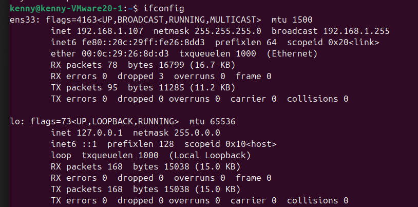

Run `ipconfig` on Windows 10 command prompt

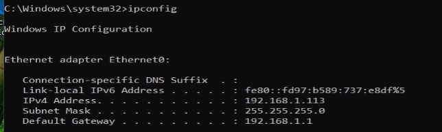

Run `ifconfig` on Kali Linux terminal

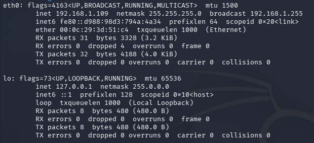

Subnet/netmask for both machines is `255.255.255.0` and the address starts with `192.168.1` hence they are in the same network/subnet.  

## Installing Wazuh
### Install Wazuh Manager
Wazuh monitoring has two parts Manager and Agent. The manager is used to analyse and produce alerts while the agent collects data(logs, file changes) and sends it to the manager. First step to installing Wazuh is installing the Manager which I did on Ubuntu machine:

1. Install appropriate packages on ubuntu (if you havent)
```bash
sudo apt update
sudo apt install -y gnupg
```

2. Installing GPG Key
```bash
curl -s https://packages.wazuh.com/key/GPG-KEY-WAZUH | sudo gpg --dearmor -o /usr/share/keyrings/wazuh-archive-keyring.gpg
```

3. Installing Wazuh Manager
```bash
curl -sO https://packages.wazuh.com/4.14/wazuh-install.sh && sudo bash ./wazuh-install.sh -a -i
```
Make sure `4.14` is set to latest version in my case it was 4.14.

Below is the finished installation image containing username and password for wazuh dashboard login.
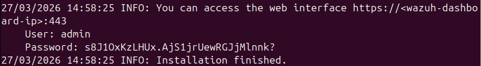

#### Resizing VM
One issue I ran into when installing wazuh manager is that my VM did not have enough space. The first thing I did was to resize the VM. You can do this by:
1. Shut down Ubuntu 
2. Go to VM on vmware
3. Go to Hard disk 
4. Expand disk capacity on the right 
5. change to 60 gb

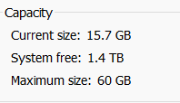

I noticed that the current size remained 15.7GB which was strange. Did some research and release my OS was only using orginal partition size and I need to resize it in the OS itself. I started by checking size on using `lsblk` which list all block device on ubunutu. 

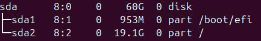

We can see that the VM has been resize but not the partition(sda2). Next I resized `sda2` using following commands.
```bash
sudo growpart /dev/sda 2
sudo resize2fs /dev/sda2
```

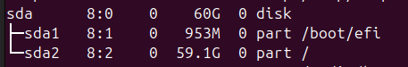

### Accessing Wazuh Dashboard
1. Use `ifconfig` or any other network command to find your device IP address 
2. Enter `https://<ipaddress>:443` where `<ipaddress>` is machine IP address
3. Login with provide credentials

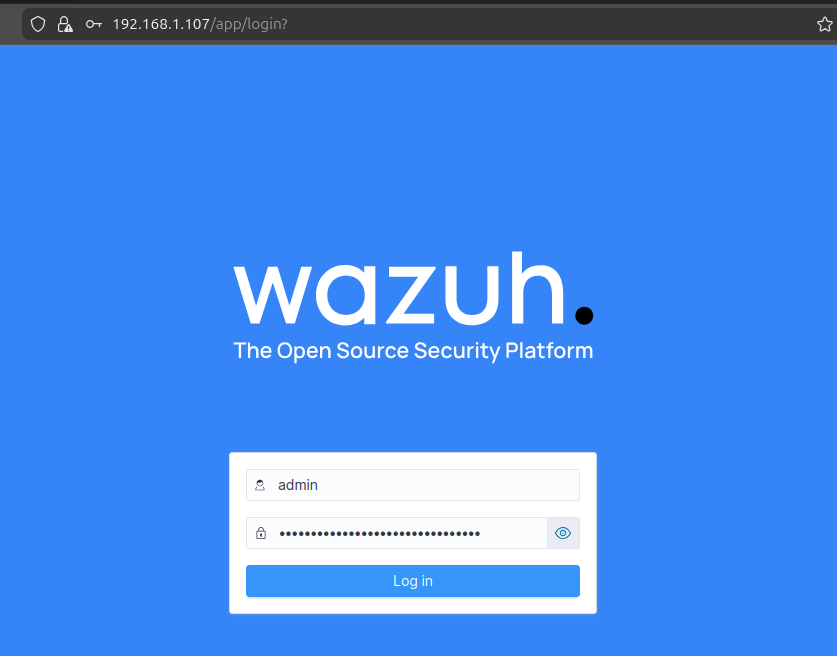

### Install and Onboard Wazuh Agent
1. Download windows installer from Wazuh Website
2. Open installer accept agreement then finish
3. Open Wazuh agent can be done via search bar

The ip entered should be the ubuntu machines IP address. To get the authentication key we will need to open the machine with Wazuh Manager.

1. Open Terminal on Ubuntu
2. Run the following command to add agents
```bash
sudo /var/ossec/bin/manage_agents
```
1. On menu enter `A` to choose adding agent
2. Enter any name for agent name and the windows machines IP address
3. To extract a key enter `E` on menu
4. Enter agent ID number
5. Go back to Windows Machine to paste authentication key
6. Save and restart agent by clicking on manage > restart

If the setup is correct you should be able to see your agent on the dashboard and clicking on active shows this.
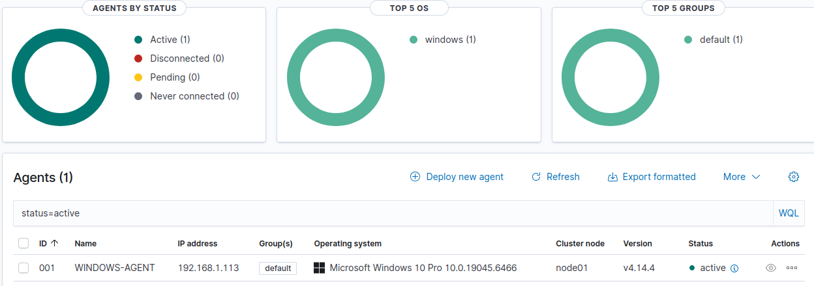

# File Integrity Monitoring Setup
File Integrity Monitoring aims to montior a specific directory for any file changes(edit, delete, add). First we need to make a directory to monitor and add it to our wazuh config file `ossec`:
1. On file explorer of Windows machine add new directory for testing my new directory is `C:\Users\kenny\Downloads\Wazuh-Test`
2. Go back to the config file and scroll till you see this (should be below file integrity monitoring and 32-bit programs)

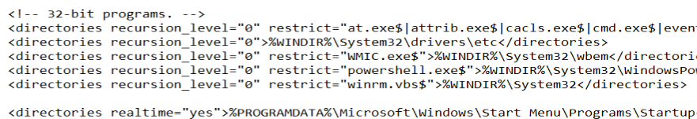

3. Below that add another directory line and replace the directory with the newly created directory

Activity on new directory can be viewed on wazuh dashboard via `WINDOWS-AGENT` > File inetgrity monitoring. From image below you can see that I have added a file called `test-1.txt`.

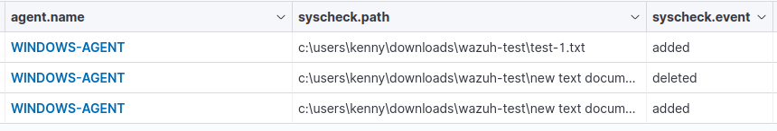

# Upcoming work
The future of this project will involve simulating attacks and detecting them with wazuh.
- [ ] Add metasploit 

# Releases
- Added Kali Linux to the network
- RDP Brute force documentation is out
- DVWA installed and being monitored
